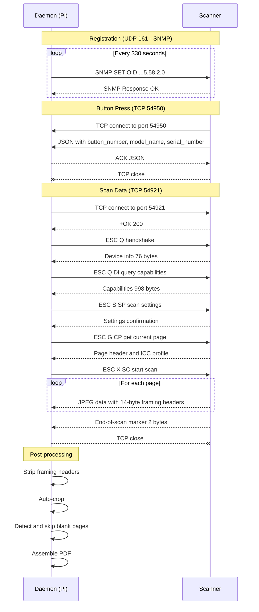

# brother-scand

A Python push-to-scan daemon for Brother ADS-series scanners. Registers with
the scanner over SNMP and listens for physical button presses, then receives
scan data over the Brother proprietary protocol on TCP port 54921.

Built by reverse-engineering the protocol used by Brother's iPrint&Scan Mac app.

## Features

- **Push-to-scan** — press the button on the scanner, pages appear on disk
- **Duplex support** — front and back pages captured automatically
- **Multi-page ADF** — scans all pages in the document feeder
- **Button profiles** — map each scanner button to different scan settings
- **Auto-crop** — removes scanner background (gray fill and white borders)
- **Blank page detection** — automatically skips empty backs of duplex scans
- **PDF assembly** — combines multi-page scans into a single PDF
- **Config-driven** — all settings in `profiles.conf`, no code changes needed

## Requirements

- Python 3.10+
- [Pillow](https://python-pillow.org/) (for image processing and PDF generation)
- A Brother ADS-series scanner on the local network (tested with ADS-1350W)

### Install dependencies

```bash
# Via pip
pip install Pillow

# Or on Debian/Ubuntu/Raspberry Pi OS
sudo apt install python3-pil
```

## Usage

```bash
# Run with auto-detected config (profiles.conf next to script)
python3 brother_scan.py -d

# Or specify options explicitly
python3 brother_scan.py 192.168.4.158 --output-dir ~/scans --config profiles.conf -d
```

The daemon will:
1. Register with the scanner via SNMP
2. Listen for button press events on TCP 54950
3. When a button is pressed, connect to the scanner's data channel
4. Receive pages, auto-crop, skip blanks, and output as PDF or JPEG

## Configuration

All settings live in `profiles.conf`:

```ini
[scanner]
ip = 192.168.4.158
hostname = rosie
output_dir = ~/scans

[button.1]
name = Duplex Color PDF
reso = 300,300
color = C24BIT
duplex = ON
crop = gray_only
output = pdf

[button.2]
name = Duplex B&W PDF
reso = 300,300
color = CGRAY
duplex = ON
crop = gray_only
output = pdf

[button.3]
name = Simplex Color HiRes JPEG
reso = 600,600
color = C24BIT
duplex = OFF
crop = tight
output = jpeg
```

### Profile options

| Option | Values | Description |
|--------|--------|-------------|
| `name` | string | Display name (shown in logs) |
| `reso` | `300,300` / `600,600` | Scan resolution |
| `color` | `C24BIT` / `CGRAY` | Color mode (24-bit color or grayscale) |
| `duplex` | `ON` / `OFF` | Scan both sides |
| `crop` | `gray_only` / `tight` | Crop mode (see below) |
| `output` | `pdf` / `jpeg` | Output format |

### Crop modes

- **`gray_only`** — Removes only the uniform gray scanner background. Preserves
  white page margins. Best for documents.
- **`tight`** — Removes both gray background and white borders. Crops tight to
  actual content. Best for photos.

## Protocol Notes

This daemon uses the Brother proprietary scan protocol (not eSCL/AirScan):

- **Registration**: SNMP SET to OID `1.3.6.1.4.1.2435.2.4.3.2435.5.58.2.0`
  with community `internal`
- **Button events**: Scanner connects to us on TCP 54950 with a JSON payload
  containing `button_number`, `model_name`, and `serial_number`
- **Data channel**: We connect to scanner on TCP 54921 for the actual scan data
- **Framing**: Scanner injects 14-byte headers every ~512KB in the JPEG stream
  (pattern: `00 02 xx 00 15 00`); these must be stripped

The older registration OID (`1.3.6.1.4.1.2435.2.3.9.2.11.1.1.0`) used by most
open-source Brother scan tools does **not** work on newer models like the ADS-1350W.

### Protocol Flow



## Installing as a System Service

These instructions install `brother-scand` as a proper systemd service with
least-privilege security hardening.

### 1. Create a dedicated service user

```bash
sudo useradd --system --no-create-home --shell /usr/sbin/nologin brother-scand
```

### 2. Install the script

The conventional location for locally-installed daemons on Linux is `/opt`:

```bash
sudo mkdir -p /opt/brother-scand
sudo cp brother_scan.py /opt/brother-scand/
sudo chmod 755 /opt/brother-scand/brother_scan.py
sudo chown root:root /opt/brother-scand/brother_scan.py
```

### 3. Install the config file

System service configs belong in `/etc`:

```bash
sudo mkdir -p /etc/brother-scand
sudo cp profiles.conf /etc/brother-scand/
sudo chmod 644 /etc/brother-scand/profiles.conf
sudo chown root:root /etc/brother-scand/profiles.conf
```

Edit `/etc/brother-scand/profiles.conf` to set your scanner IP, hostname, and
output directory. Note: since the service runs as a dedicated user, use an
absolute path for `output_dir` (not `~`):

```ini
[scanner]
ip = 192.168.4.158
hostname = scanner
output_dir = /var/lib/brother-scand/scans
```

### 4. Create the output directory

```bash
sudo mkdir -p /var/lib/brother-scand/scans
sudo chown brother-scand:brother-scand /var/lib/brother-scand
sudo chown brother-scand:brother-scand /var/lib/brother-scand/scans
```

### 5. Install the systemd unit

```bash
sudo cp brother-scand.service /etc/systemd/system/
sudo systemctl daemon-reload
```

### 6. Install Python dependencies

```bash
sudo apt install python3-pil
```

### 7. Enable and start the service

```bash
sudo systemctl enable brother-scand   # start on boot
sudo systemctl start brother-scand    # start now
```

### Managing the service

```bash
sudo systemctl status brother-scand   # check status
sudo journalctl -u brother-scand -f   # follow logs
sudo systemctl restart brother-scand  # restart after config changes
sudo systemctl stop brother-scand     # stop (unregisters cleanly)
```

### File layout summary

```
/opt/brother-scand/
└── brother_scan.py            # The daemon script (root-owned, 755)

/etc/brother-scand/
└── profiles.conf              # Configuration (root-owned, 644)

/var/lib/brother-scand/
└── scans/                     # Scan output (owned by brother-scand user)

/etc/systemd/system/
└── brother-scand.service       # systemd unit file
```

### Security notes

The systemd unit includes several hardening options:

- **Dedicated user** — runs as `brother-scand`, not root
- **ProtectSystem=strict** — filesystem is read-only except explicitly allowed paths
- **ProtectHome=true** — cannot access `/home`, `/root`, or `/run/user`
- **NoNewPrivileges** — cannot escalate privileges
- **PrivateTmp** — isolated `/tmp`
- **ReadWritePaths** — only `/var/lib/brother-scand` is writable

The daemon only needs network access (UDP 161 for SNMP, TCP 54950 inbound,
TCP 54921 outbound) and write access to the output directory.

### Uninstalling

```bash
sudo systemctl stop brother-scand
sudo systemctl disable brother-scand
sudo rm /etc/systemd/system/brother-scand.service
sudo systemctl daemon-reload
sudo rm -rf /opt/brother-scand /etc/brother-scand
sudo userdel brother-scand
# Optionally remove scan output:
# sudo rm -rf /var/lib/brother-scand
```

## Tested On

- Brother ADS-1350W
- Raspberry Pi 5 (Debian Bookworm, arm64)
- Python 3.11 + Pillow 11.1

## License

MIT
